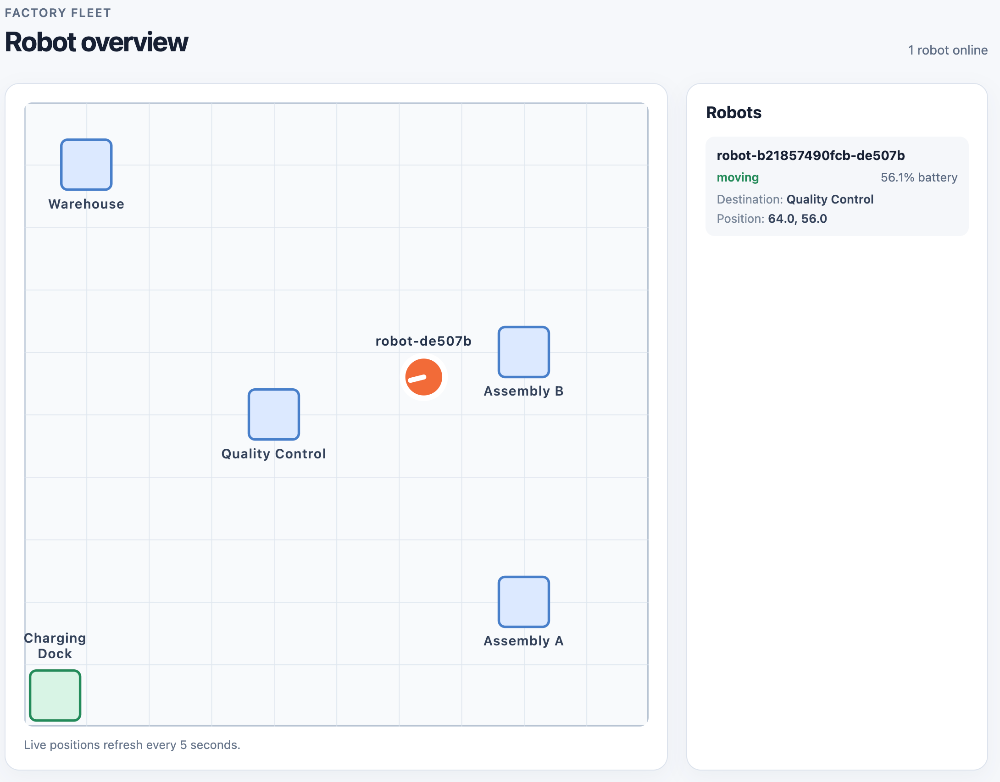

# k3s-fleet

A small robot-fleet demo. The simulator sends position and status updates over
MQTT. The telemetry API stores them in PostgreSQL and shows the latest position
of active robots on a factory-floor dashboard.



```text
device-sim -> Mosquitto -> telemetry-api -> PostgreSQL
```

## Stack

- Python 3.11, Paho MQTT, FastAPI, Pydantic, SQLAlchemy, and psycopg
- Mosquitto with MQTT over TLS and password authentication; PostgreSQL for telemetry storage
- HTML, CSS, JavaScript, and SVG for the live factory-floor dashboard
- Docker Compose locally; K3s, Kustomize, and Traefik for cluster deployment
- uv, pytest, Ruff, and GitHub Actions for tests, GHCR publishing, and image-update PRs

## Image updates

GitHub Actions tests each service and publishes its image to GHCR. After a
successful publish on `main`, it opens or updates a PR with the new image SHA
in Kustomize. Review and merge the PR, then deploy when ready. Deployment
stays manual. See the [K3s guide](k8s/README.md#use-the-published-images).

## Run locally

From the repository root, create local MQTT certificates and credentials once,
then start the stack:

```bash
bash scripts/setup-local-secrets.sh
docker compose up --build
```

Open the [dashboard](http://localhost:8000) or the [API docs](http://localhost:8000/docs).
Press Ctrl+C to stop the foreground Compose run.

For a local K3s cluster, see the [K3s guide](k8s/README.md). The simulator and
API also have their own READMEs under `services/`.

Possible next steps are listed in the [improvement scope](docs/improvements.md).
